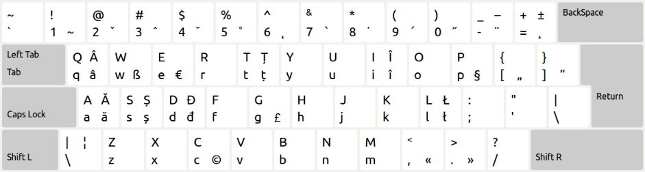
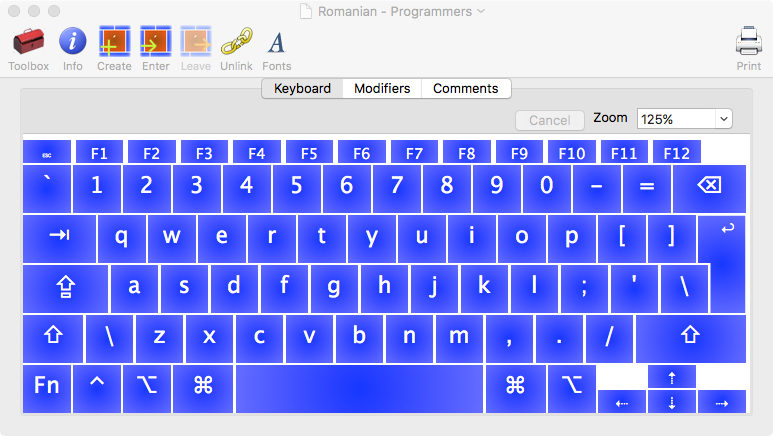
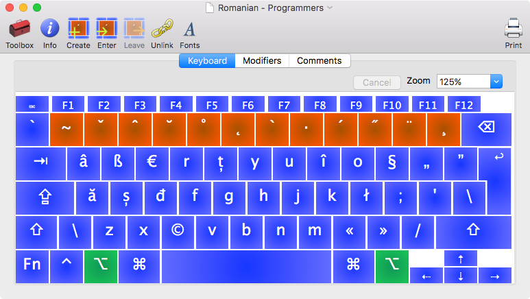

## Despre

Aranjament de tastatură "Romanian - Programmers" pentru Mac OS X / macOS. Proiect implementat folosind [Ukelele](http://scripts.sil.org/cms/scripts/page.php?site_id=nrsi&id=ukelele) conform [SR 13392:2004](http://www.secarica.ro/kbdro_help_romanian_standard_ro.pdf).

Pe scurt:

* `ALT + a` &rarr; _ă_
* `ALT + q` &rarr; _â_
* `ALT + i` &rarr; _î_
* `ALT + s` &rarr; _ș_
* `ALT + t` &rarr; _ț_

Extensie non-standard:

* `ALT + g` &rarr; £ - disponibilă în ramura [non-standard/uk](https://github.com/SaltwaterC/romanian-programmers-mac/tree/non-standard/uk)

Imaginea de ansamblu a aranjamentului:



Aranjamentul implicit fără a apăsa taste de modificare:



Aranjamentul cu tasta de modificare ALT:



Implementarea este completă, însă prezintă următoarea deficiență: ambele taste ALT (option) au rolul de AltGr. AltGr este interpretată drept CTRL + ALT, dacă această tastă există. Apple nu are AltGr pe tastaturile proprii. Combinațiile s-ar complica într-un mod inutil pentru aproduce același rezultat. Din moment ce din punct de vedere hardware, tastele sunt identice, `rightOption` în loc de `anyOption` nu se poate folosi. Această deficiență nu poate fi rezolvată pentru o tastatură Apple.

## Instalare / Actualizare

```bash
curl --silent --location --max-redirs 10 https://raw.githubusercontent.com/SaltwaterC/romanian-programmers-mac/master/install.sh --output "/tmp/rpm-install.sh" && bash "/tmp/rpm-install.sh" && rm -f "/tmp/rpm-install.sh"
```

**Atenție!**

 * la instalare trebuie activat din:
  * *System Preferences > Language & Text > Input Sources > Romanian - Programmers* (OS X 10.8).
  * *System Preferences > Keyboard > Input Sources > [+] > Others > Romanian - Programmers* (OS X/macOS 10.9+).
 * la actualizare este nevoie de un logout + login pentru ca schimbările să fie vizibile. În cazul lui OS X/macOS 10.9+, s-ar putea să fie nevoie de reactivare dacă se execută o actualizare.
 * scriptul de instalare invocă sudo pentru a putea executa acțiunie dorite. Dacă securitatea este o problemă, este recomandată clonarea acestui depozit, urmată de o instalare manuală, sau de o instalare locală (`./install.sh local`) după ce scriptul de instalare este inspectat.
